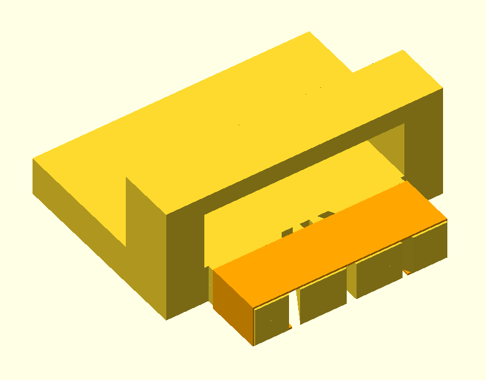
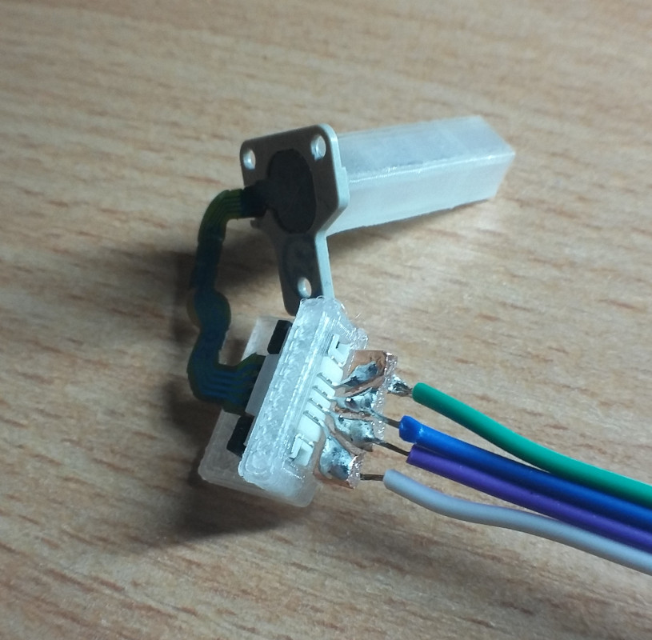

# 3DS C-stick as a trackpoint

This is not complicated to do but I didn't find any guides on this or even anyone saying they'd done it, so I made this little guide.

## Circuitry

This is the C-stick module:

The C-stick module has 4 pressure sensistive variable resistors:

These are the two circuits (one for each axis) we'll use with the C-stick module:

- Red is connected to VCC.
- White is connected to ground.
- Green is between 2 of the variable resistors and where we read the voltage.

## Connecting wires

In order to connect wires to the C-stick module you'll need a 4-pin FFC (FPC) ZIF connector with 1mm pitch. These are usually surface mount, so a PCB is preferred. However if you don't want to use a PCB, this is what I did:

3D print this:

- [OpenSCAD file](./parts/zif-connector-mount.scad)
- [STL file](./parts/zif-connector-mount.stl)

Put copper tape around here:

Cut the tape at the grooves:

Bend the connector pins into a fan so they line up with the 4 areas of on the copper tape. Now you have some larger pads you can solder both the pins and wires to.

Final result:

## Signal strength

Signal strength is weak with the stock nub and a 10bit ADC. A 20mm 3D-printed nub helps. Using a 12bit ADC for a 4x increase in resolution should be a good boost.

## Firmware

[Basic firmware for Arduino](./firmware/arduino.cpp) (Bad deadzone implementation; prevents small movements.)

## Buying

3DS C-stick modules are available on AliExpress/Alibaba. Single unit is around 15 USD. When buying in bulk (20+ units) the price goes down to around 5 USD.

The ZIF connectors can be found on many electonics stores (eg/ Mouser) or eBay. These typically cost under 1 USD each but you may have to buy a multiple.

